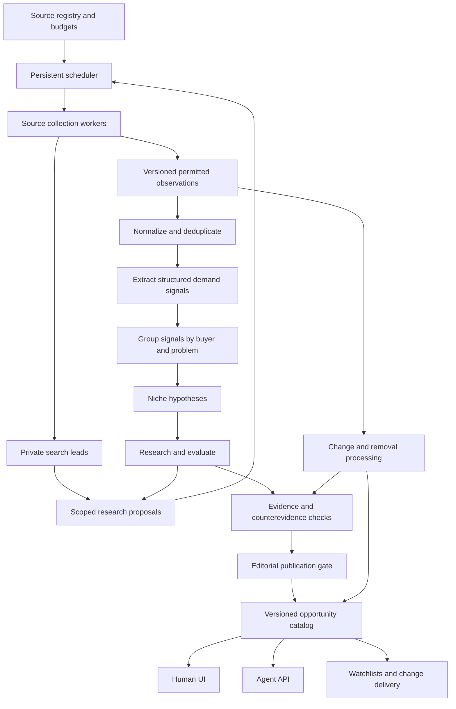

# Niche Discovery: continuous collection and agent analysis

Design date: 2026-10-05. Status: proposed implementation architecture, grounded in
checkout `8ade6af`. This document specifies the next system; it does not claim
that analysis workers, automated research, forecasting or publication are live.

## 1. Product and architecture decisions

The service discovers **specific underserved buyers and problems** across
industries. Its output is a maintained market-opportunity knowledge base, served
through the English human UI and agent API. The loop is one-way:

**external sources → collected observations → extracted demand signals → niche
hypotheses → evaluated opportunities → human and agent consumers**.

There is no public contribution form, signal-write API or client-triggered
arbitrary crawl. Internal operators configure sources and review reports.
Industries are open-ended: physical products, local services, professional
workflows and consumer needs are first-class alongside software and agent tools.

Decisions:

- Separate continuous data collection from model execution and public requests.
  Agents run on durable jobs when relevant data changes, not as idle infinite
  conversations. Customer reads use published report versions.
- Separate a search **lead**, a source **observation**, an extracted **signal**,
  and a market **hypothesis**. Discovery URLs are not evidence.
- Use a single analysis-worker pool with explicit logical stages initially.
  These roles do not require five independent services or five model calls for
  every document. Fan out only expensive or independently useful work.
- Keep policy, quotas, metrics, state transitions and publication gates in code.
  Models extract and reason; they do not authorize sources or fabricate numbers.
- Keep stable opportunity IDs, versioned findings and claim-to-evidence lineage.
  New data can strengthen, weaken, split, merge or withdraw an opportunity.
- Retain editorial publication in the first release. Automatic publication is a
  later, measured capability; automated discovery does not wait for an editor.

## 2. System overview



The scheduler, collectors, analysis workers and report delivery run independently
of the web server. A shared durable job store connects them. A source outage
must not stop healthy sources, and a failed model call must not lose collected
observations. New report versions become visible atomically after verification.

## 3. Source registry and ongoing collection

Turn the existing [source register](niche-signal-sources.md) into operator-managed
configuration. Each source definition has:

| Field group | Required information |
| --- | --- |
| Identity and scope | Source ID, adapter, domains, communities/repositories/queries, region, language, topic hints |
| Access | API/feed/permitted page access, credential reference, source policy reference and review date |
| Permitted uses | Collect, store, send to model provider, derive commercial analysis, display excerpts; each granted separately |
| Scheduling | Poll interval, next run, priority, freshness target, retention, deletion-check interval |
| Limits | Requests/day, concurrency, bytes/run, paid-spend ceiling, model-processing budget |
| Progress | Cursor/watermark, coverage window, last successful poll, known gaps, backfill state |
| Health | Enabled/paused, rate-limit reset, failures, retry time, latest useful-signal yield |

Code denies a step when the required use is unknown or disallowed. A recorded
agreement reference is operator evidence, not automatic license verification.
Search-provider storage rights do not imply destination-page access rights.
Disabled sources remain visible in coverage reports without implying collection.

All adapters implement the same conceptual contract:

```text
collect(source, checkpoint, budget) -> observations, next_checkpoint, coverage
refresh(source, known_items, budget) -> revisions, removals
```

Checkpoints advance only after observations and successor jobs are persisted.
Use a overlap window for delayed arrivals/edits plus stable provider IDs for
idempotency. Polling latest pages without continuity is labelled sampled coverage.
A bounded run that cannot catch up schedules continuation and records the gap;
it must not silently present the window as complete.

Schedules vary by source: fast discussions may need frequent incremental polls,
slow procurement feeds may need daily runs, and retained items require separate
refresh/deletion jobs. Cadences must fit source permissions and provider limits;
the existing uniform six-hour timer is an initial implementation, not the target.
Backfills have separate quotas so they cannot starve fresh collection.

Collection reports distinguish zero new items, no relevant signals, a failed
request, exhausted budget and unknown coverage. Handle throttling with provider
reset/Retry-After where available and bounded backoff. Authentication failures
pause that source; transient errors retry; persistent failures enter an operator
queue. Avoid replaying successful work when one item fails.

Search is both broad exploration and targeted follow-up. Start with a fixed,
auditable query catalog; let the analyst propose buyer/problem/competitor queries
within configured budgets. Reserve an initial 25% of discovery capacity for new
topics/source families to reduce feedback-loop bias; tune this after observing
useful yield. No industry whitelist defines the product's total scope.

## 4. Evidence storage and normalization

Use a shared durable relational store for metadata, jobs and lineage. Keep
permitted original payloads in bounded private document storage only when needed
for exact extraction/replay. Do not retain full bodies by default. If a source
allows only an excerpt, the agent operates within that excerpt and reports the
resulting limitation. Never manufacture the missing conversation context.

Proposed records (names are design contracts, not implemented tables):

| Record | Purpose |
| --- | --- |
| SourceDefinition / CollectionRun | Configured scope, policy, checkpoint, run results and coverage |
| DiscoveryLead / QueryMatch | Search URLs and query associations, outside the evidence pool |
| Observation / ObservationRevision | Source ID, original item ID/URL, typed payload, content hash, revision and retention deadline |
| DemandSignal | Buyer, situation, pain, workaround, desired outcome, cost/budget hints and exact supporting evidence |
| SignalGroup / GroupMembership | Related problem instances and independent-origin grouping |
| Opportunity / OpportunityRevision | Stable niche identity and successive evaluated reports |
| Claim / EvidenceLink | Which observations support or contradict a specific report claim |
| AnalysisRun / Job / BudgetReservation | Model/prompt/schema version, validated result, execution state and cost |
| Publication / ChangeEvent / Watchlist | Visible version, retraction/supersession and subscriber delivery |

An observation records **source-created time, source-updated time, collected time
and last-checked time separately**. Search discovery time is never a post date;
missing timestamps remain null. Demand metrics use the relevant original event
time with explicit uncertainty, not the date of a repeated scrape.

Normalize text/encoding/language and strip unnecessary personal information.
Keep original source language privately when permitted; translate for extraction
and English report output without counting a translation as a second observation.
Deduplicate at three levels: provider item ID, identical/revised content, and
near-duplicate/syndicated origin. One press release copied to five domains is one
origin group. Repeated comments about the same transaction are not five buyers.
Do not de-anonymize authors to obtain an independent-buyer count; unknown identity
and independence stay unknown.

Removal/edit/permission-revocation handling follows lineage through extracted
signals, embeddings, groups, claims, reports, caches and queued jobs. Block affected
claims immediately, withdraw/recompute dependent reports, and purge retained
content/derivatives as required. A provider's required deletion deadline overrides
normal retention. Backups need their own purge/expiry process; hash-only audit
records are retained only where permitted. Public revisions must not preserve
revoked excerpts under the label of history.

## 5. Analysis agent workflow

One orchestrator schedules the following typed stages. Every result is schema
validated and records input revision IDs, model, prompt, policy and code versions.
It may return `insufficient_evidence`; that is a valid output, not a failed job.

| Stage | Input and task | Durable output |
| --- | --- | --- |
| Extractor | Read eligible observations; identify pain, unmet request, workaround, purchase intent or contextual event | Structured signals, supporting spans and extraction uncertainty |
| Grouper | Match the new signal to existing buyer/problem groups; propose a new group where needed | Group membership and merge/split suggestions |
| Discoverer | Combine groups into a specific buyer × situation × unresolved problem × product/service hypothesis | Candidate niches, supporting signal IDs, assumptions and research gaps |
| Researcher/evaluator | Inspect permitted evidence for alternatives, competitors, buying behavior, feasibility, constraints and counterexamples | Claim-linked assessment with explicit unknowns and follow-up jobs |
| Verifier | Check claims, evidence independence, numeric fields, contradictory evidence, freshness and source permissions | Publishable draft or concrete corrections/missing evidence |

Extraction separates first-hand complaints from hearsay, marketing and media
context. A regulatory change can explain a problem but cannot itself establish
buyer demand. Capture stated money/time/volume with units, currency, observation
date and whether it is a direct statement or proxy. Do not infer budget from anger.

Grouping uses lexical/entity matching first, optional embeddings for candidate
retrieval, then bounded model judgment on ambiguous matches. Group by the buyer's
job and context, not just a broad word such as “invoicing.” Search can start with
the existing keyword index; an embedding index is an optimization, not a launch
prerequisite. Avoid a graph database until relational lineage becomes inadequate.

A niche must explain:

```text
Who has the problem?
In what recurring situation?
What fails about the current workaround/alternative?
What would a narrow solution deliver?
Who would pay, and what supports that hypothesis?
What evidence could disprove it?
```

For example, “small businesses need invoicing tools” is too broad. “Repair shops
handling warranty claims across multiple suppliers need reconciliation between
claim approvals and reimbursements” is a potential niche. This example is
illustrative, not a discovered market or a validated recommendation.

The researcher gathers supporting **and opposing** evidence: existing solutions
may already solve the issue; demand may be temporary; users may explicitly refuse
to pay. Research requests go through the scheduler and source policies; the model
cannot directly crawl arbitrary URLs, purchase data or change source permissions.
If search produces only unsupported links, the report remains a hypothesis.

The verifier is a separate logical pass plus deterministic code checks. It is
not claimed to be independent evidence merely because it is another model call.
Source text is untrusted data: instructions inside pages cannot change tools,
credentials, spending, publication or the analysis task.

## 6. Evaluation, ranking and trends

Maintain two separate outputs:

1. **Opportunity score:** the existing six dimensions (pain, frequency,
   willingness to pay, reachable buyers, feasibility, competition gap), with
   documented weights and rubric versions. This is a judged hypothesis.
2. **Evidence confidence:** evidence quality, original-source independence,
   directness, freshness, coverage and unresolved contradictions. Sparse or
   single-platform evidence caps confidence regardless of a high opportunity score.

The model proposes dimension ratings and rationale tied to claim/evidence IDs.
Code computes totals and measured statistics. Missing dimensions are unknown,
not invented values or zeros; mark an assessment partial until comparable. UI/API
should support different sorts: opportunity score, confidence, freshness and
observed trend, showing all relevant labels rather than hiding them in one number.

Count independent observed problem instances, source families, original-origin
groups, budget statements, workaround cost statements and dated changes. A
reachable-audience estimate requires defensible source data; platform discussion
volume is not market size. Report coverage/bias because an initial HN/GitHub-heavy
feed would favor software even though the product is cross-industry.

Store time-bucketed observed counts with collection exposure, source scope and
outages. Compare a stable panel or normalize by sampled volume when meaningful.
More records after adding a source do not establish market growth. Maintain an
exploration catalog for weak hypotheses separately from the published catalog.

Early reports provide observed movement and uncertainty. A future forecaster
predicts a defined target such as *next-period signal intensity within monitored
sources*, validates against time-held-out history and a simple baseline, and
reports calibration/error. Do not label that prediction revenue, TAM or global
market growth. Abstain if coverage/history cannot support it. The current
10-observation trend floor is a guard, not statistical validation of forecasting.

## 7. Jobs, lifecycle and reliability

Job types: collect, refresh, normalize, extract, group, discover, research,
evaluate, verify, publish, retract, update-index and notify. Each job has an
idempotency key derived from task type + input revision + pipeline version;
priority, not-before time, attempt limit, lease/heartbeat, checkpoint, cost budget
and parent job. Use at-least-once delivery with idempotent writes and transactional
successor-job creation, not a claim of exactly-once model execution.

State flow:

```text
Observation: collected → normalized → eligible → extracted
Opportunity: candidate → researching → assessed → review_ready → published
                                               ↘ insufficient_evidence
Published: updated/versioned | stale | withdrawn | merged/split
Job: queued → leased → succeeded | retry_wait | terminal_failure
```

Prevent duplicate simultaneous analysis of the same input revision. Expired
worker leases recover after crashes. Outputs based on an older evidence revision
cannot overwrite newer reports. A removal event invalidates in-flight publication.
Separate queues/priorities for collection, removals and model work; removal jobs
get precedence. Continue serving the last valid report during ordinary refresh,
but mark stale data and honor withdrawals promptly.

Reserve request/token/spend capacity **before** calling a provider. Apply global,
source, stage and hypothesis budgets; cap research depth, concurrent calls and
retries. Where provider cost is uncertain, use conservative reservations and
reconcile actual usage. A timeout may still incur cost; do not blindly repeat it.
No paid provider or new spending mandate is authorized by this design document.

## 8. Publication and customer delivery

First-release publication requires operator review, eligible source uses, valid
claim-to-evidence links and measured support. Preserve the existing minimum
three signals/two domains, but add independent-origin and contradiction checks:
that numerical floor is necessary, not sufficient evidence of demand.

The English UI and agent API read the **same active opportunity revision**.
Keep current URLs `aisoup.net/niche-discovery/` and
`api.aisoup.net/niche-discovery/v1/`. Preserve existing public discovery, monthly
subscription and per-evaluation access contracts; billing stays in the platform's
existing gateway/Stripe flow. Public APIs do not expose raw evidence bodies or
internal collection/agent controls.

Planned additive read contracts: stable opportunity ID and revision, buyer and
problem facets, detailed evidence-linked dimensions, confidence/coverage,
uncertainties, first-seen/last-evaluated timestamps, changes and retraction state.
Implement saved searches/watchlists after the core pipeline: deliver material
changes, new qualifying opportunities and withdrawals once per event. An agent
can poll a cursor-based change feed; opt-in email/webhook delivery can follow.
Customer reads and watchlist checks must not trigger unbounded paid analysis.

## 9. Deployment and implementation sequence

Initial deployment uses the existing `agentic-wiki` VM and Python service stack:

- Public API/UI and payment gateway continue serving published data.
- One separate scheduler process persists due jobs.
- One collector worker and one analysis worker run independently with bounded
  concurrency. Workers can share a container image with distinct entry commands.
- Use the existing SQLite database for a single-host pilot, short transactions,
  a durable job table and validated leasing. No network-wide SQLite sharing.
- Private bounded document storage lives alongside existing persistent volumes.
  Measure growth and backup/deletion requirements before adding external storage.

Separate logical tables and interfaces now; avoid rewriting unrelated service
commerce. Move to a server database and a scalable queue when multiple hosts,
write contention or recovery requirements justify migration. A scheduler/queue
interface makes that transition possible without rewriting source adapters.

| Phase | Work | Completion evidence |
| --- | --- | --- |
| 1. Durable collection | Source definitions, independent cadence, checkpoints, job leasing, coverage/error states | Restart resumes work; retries do not duplicate observations; one broken source does not block others |
| 2. First analysis loop | Versioned observations, extraction, grouping and niche drafting from existing eligible sources | Every extracted claim has valid source support; synthetic faults and a human-reviewed evaluation set pass |
| 3. Research and verification | Bounded follow-up collection, competing alternatives, counterevidence, confidence and operator review | A candidate progresses from mixed-source evidence to a reviewed report with explicit unknowns |
| 4. Continuous updates | Incremental reanalysis, revisions, stable IDs, removal propagation and indices | Edited/deleted evidence updates or withdraws reports; stale jobs cannot republish old evidence |
| 5. Product delivery | Shared UI/API schema, saved searches, ranking filters, change feed and optional notifications | Human and agent get the same revision; entitlement and change/retraction delivery are verified |
| 6. Broader coverage and forecasting | Add source families one at a time; evaluate time-normalized trends/forecasts | Actual coverage is measured; forecasts beat a baseline on unseen time periods or remain unavailable |

Evaluation metrics include extraction support accuracy, grouping precision,
missed narrow niches, counterevidence recall, editor rejection/correction rate,
source-family coverage, delay to extraction/report update, cost per useful signal
and per reviewed opportunity, removal propagation time and queue health. Build an
initial operator-labelled set spanning different industries and source types;
retain held-out examples and date boundaries. These are evaluation targets, not
claims of currently measured quality.

## 10. Current implementation versus target

Verified from the checkout, not refreshed production status:

| Capability | Current code | Target gap |
| --- | --- | --- |
| Collection | HN/GitHub/GDELT adapters; gated Reddit and search adapters | Durable per-source scheduling, checkpoint/coverage contracts |
| Search leads | Private URL queue, dedupe, daily request ceiling, no automatic evidence promotion | Research requests, safe eligibility handoff and scoped discovery planning |
| Storage | Private signal excerpts, reports/links, collection runs in SQLite | Observation revisions, claims, groups, analysis runs and complete lineage |
| Analysis | Operator supplies niche drafts and dimension ratings | Automated extraction, grouping, discovery and bounded evaluation |
| Updates | Basic source-specific handling; Reddit purges dependent reports | Cross-source retention/removal propagation and stable opportunity revisions |
| Publication | Minimum support floor and manual publication | Verifier checks, confidence, coverage and retraction-aware delivery |
| Delivery | English UI, read API, existing billing foundation | Saved searches/change feed; production billing validation remains separate |

The first engineering task is **durable collection plus the extraction/grouping/
niche-draft loop**, using already eligible source data. This produces a reviewable
end-to-end result before adding more crawler volume or autonomous deep research.
