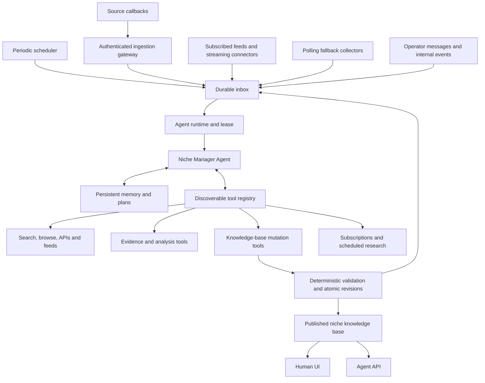

# Niche Manager Agent

Updated 2026-10-06. The first autonomous runtime is implemented; see
[niche-manager-operations.md](niche-manager-operations.md) for configuration,
verification and remaining connector work. Later sections describe the broader target architecture.
This specifies the autonomous knowledge-base manager requested by the user and
supersedes fixed-stage/manual-publication assumptions in the earlier design.

## Product contract

One persistent **Niche Manager Agent** owns the niche-market knowledge base.
It can discover sources, gather eligible external information, plan research,
analyze evidence, discover narrow markets, revise assessments and publish or
withdraw knowledge-base entries. The agent selects and composes any available
tool; its behavior is not restricted to a fixed collector-to-report script.

Human users and external agents consume the same published database through
`aisoup.net/niche-discovery/` and `api.aisoup.net/niche-discovery/v1/`.
The existing one-way product contract remains: no customer signal-contribution
form/API. Trusted source callbacks and internal agent messages are ingestion
infrastructure, separate from customer-facing contribution endpoints.

“Available” means a tool is registered, executable in this environment and usable
under configured access/credentials. The agent sees the entire available tool
catalog and can select tools dynamically. Existing source rights, platform
budgets and operator authorization apply inside tool execution, rather than
requiring a person to approve every routine research or database update.

## Architecture



A single logical manager is distinct from a single operating-system process.
Runtime processes may restart, and tools may use background workers or parallel
I/O. There is one active manager lease per knowledge base initially, avoiding
competing agents issuing contradictory revisions. Long-running tools release
execution resources and return completion events to the same manager.

## Full agent runtime

Use a high-capability reasoning model as the primary manager, configurable by
provider/model/version. A cheaper model can implement optional extraction or
translation tools; it does not determine what the manager is permitted to reason
about or which tools it may select. Choose the concrete model and benchmark it
before implementation; this document authorizes no new provider spend.

Each wake cycle:

1. Lease a batch of pending events and load the current mission, relevant memory,
   unfinished plan, source health, knowledge-base revisions and available tools.
2. Decide whether to investigate a new theme, strengthen an existing hypothesis,
   find counterevidence, refresh stale information, repair an ingestion problem,
   revise/merge/split a niche or take no action.
3. Build or revise a persistent plan. Search memory/database before acquiring
   duplicates; choose tools and run parallel independent reads where useful.
4. Inspect results, change the plan, recover from errors and perform further tool
   calls. Tool results can create evidence records or durable follow-up jobs.
5. Commit supported knowledge-base changes through typed mutation tools and record
   rationale, supporting/contradicting evidence and remaining uncertainty.
6. Save plan/memory/run records. Acknowledge only handled events, then yield or
   enqueue a continuation when more work remains.

This is a multi-turn observe/plan/act/check loop with tool-error recovery, not a
single prompt that returns a report. Tools have structured arguments/results,
timeouts, asynchronous job handles and error categories. New events arriving
mid-run remain durable; the manager checks urgent removal events at safe points.

Working memory contains the current objective, task plan, hypotheses and selected
evidence. Long-term memory holds research decisions, failed approaches, source
quirks and unresolved questions. Memory is accessed through native read/search/
write tools and reference IDs; context compaction does not destroy stored records.
Private credentials are resolved outside the model context. Permission-revoked
source derivatives must also be removed from memory and retrieval indices.

## Tool catalog

Every operation the manager needs is available as a tool, with a uniform registry
schema: name/version, description, input/output schema, credential/access scope,
read/write classification, idempotency support, cost reservation, timeout and
asynchronous behavior. Built-in tools and approved MCP/connector tools share this
interface. Registry discovery is itself a native tool; installed tools become
visible without editing the agent's fixed workflow.

| Tool family | Initial capabilities |
| --- | --- |
| Tool discovery | List/search tools, inspect schemas and current availability |
| Source discovery | Search web indices, inspect source scope/policy/health, propose new sources |
| External information | Read permitted URLs, browser pages, APIs, RSS/Atom feeds, approved social/commerce connectors and source records |
| Acquisition control | Collect/refresh a source, continue a cursor, request bounded backfill, get collection coverage |
| Event subscriptions | List/create/update/pause approved source subscriptions; configure polling fallback and research schedules |
| Evidence | Store/version eligible observations, locate supporting spans, deduplicate, inspect provenance and revoke evidence |
| Analysis | Query related signals, group/merge/split themes, compute statistics, compare time windows, translate and search competing alternatives |
| Code and computation | Execute bounded analysis code against scoped datasets, produce tables/charts and validate calculations |
| Knowledge base | Search/read/create/update niche candidates; attach claims and evidence; evaluate, publish, supersede, merge, split and withdraw revisions |
| Memory and planning | Read/search/write memory, checkpoint plans, schedule follow-up, record unresolved questions |
| Operations | Inspect job/source health and tool failures, retry eligible work, pause a malfunctioning source, report an unresolved blocker |

Do not expose only these families forever: the registry is extensible. Adding a
connector requires installing/registering its executable tool and configuring its
access, not redesigning the agent. The manager may change queries, research
priorities and subscriptions within available scopes. Granting new credentials,
commercial rights or budget increases remains an operator configuration action.

URL/browser tools enforce destination checks, permitted source access and content
limits. Code tools run in an isolated execution workspace with scoped data/tool
handles, not access to deployment credentials. These execution boundaries protect
service infrastructure while preserving open-ended research and computation.
External pages, callbacks and tool outputs are data, never authority to change the
agent's mission, permissions or system instructions.

## Periodic wakes and external events

The persistent scheduler emits `agent.tick` on a configurable cadence; start with
a six-hour heartbeat and tune to measured cost/freshness. Ticks let the manager
proactively discover new topics, pursue unfinished plans and refresh stale niches
even without new external messages. Source collection/subscription schedules are
independent: use push delivery where available and polling where unavailable.

Callbacks may contain content or merely “something changed.” The gateway verifies
the provider and envelope, then either persists eligible content or a pointer.
The manager can fetch authoritative details through an available source tool.
Push delivery does not guarantee full source coverage: reconcile periodically
using provider checkpoints where supported. Track delivery gaps, renew expiring
subscriptions and fall back to polling when permitted.

Proposed private infrastructure route:

```text
POST /internal/niche-discovery/source-events/{subscription_id}
```

An internet-reachable callback is authenticated with provider signatures or a
subscription-specific mechanism; it is not a public unauthenticated input API.
Support provider handshake challenges, signature timestamp/replay validation,
body limits and event/schema validation. Subscribe to only the callback types
actually supported by that provider. An adapter owns its protocol details.
Never claim all media/social/shopping platforms support callbacks.

Return success only after the event is durably committed. If persistence fails,
return a retryable failure. Deduplicate by subscription/provider event ID; use an
adapter-defined stable hash only where IDs do not exist. Retain permitted raw
payloads briefly for reconciliation, separate from the model's normalized inbox.
Source/permission revocation can disable subscription ingestion immediately.

Core event envelope:

```text
event_id, provider_event_id, event_type, source_id, subscription_id,
entity_id, entity_revision, source_event_at, received_at, priority,
payload_ref, dedupe_key, correlation_id, delivery_state
```

Event types include `agent.tick`, `source.item.created`, `source.item.updated`,
`source.item.deleted`, `source.batch.ready`, `subscription.expiring`,
`source.health.changed`, `research.completed`, `knowledge.stale` and
`operator.message`. Unknown event types go to an inspectable quarantine.
Internal database-change events record the originating run, preventing the
agent's own publication from endlessly waking the same research task.

## Durable inbox and job semantics

The inbox drives reasoning; the tool-job queue executes requested work. Keep
them logically separate even if both initially live in SQLite. Persist agent
runs, event-to-run associations, plans, tool calls/results and successor jobs.

```text
Event: received → pending → leased → handled
                           ↘ retry_wait → pending
                           ↘ terminal_failure
Run: queued → running → waiting_for_tool | checkpointed | completed | failed
```

Use at-least-once delivery and idempotent tool/database operations. Duplicate
callbacks must not create duplicate evidence or repeated publications. A lease
and heartbeat prevent two managers from processing the same batch concurrently;
lease expiry recovers a crashed process. Writes use expected revision numbers
so stale plans cannot overwrite newer evidence. An atomic commit records a
knowledge revision and its successor events together.

Debounce related events into bounded batches; prioritize deletion/revocation over
new-content research. Each run has finite time/tool/token budgets. Upon reaching
a limit, checkpoint the plan and schedule a continuation at an eligible time;
retain full capabilities across wakes. Exhausted daily budgets sleep until reset,
not endless immediate continuation events. Bursts apply backpressure and fair
source quotas so one noisy platform cannot consume the whole manager.

Failure recovery reuses stored tool receipts/results. For uncertain external side
effects, inspect outcome before repeating the write. Claiming exactly-once external
execution is not warranted. Permanently failed events retain enough permitted
metadata to diagnose/requeue them without silently disappearing.

## Autonomous knowledge-base maintenance

The manager owns normal curation: create, update, merge, split, publish and withdraw
niches using the mutation tools. Human approval is not mandatory for every report.
The backend validates evidence eligibility, lineage, expected revision, numeric
calculations, coverage labels and the publication contract before accepting a
write. A failed gate returns actionable deficiencies to the agent.

Potential score, evidence confidence, measured observations and model hypotheses
remain separate. Insufficient evidence produces a private candidate and further
research, not invented market size or a forced published entry. Initially preserve
the existing support floor, add independent-origin/claim checks, and verify behavior
on an operator-labelled evaluation set before enabling autonomous publication.
Operator review is available for exceptions/audits, rather than the normal
maintenance engine. Startup rollout settings must state whether autonomous
publication is enabled; the current implementation remains manual.

The website and API use one atomic published projection with active revision,
evidence links, confidence, coverage, update time and withdrawal state. Users can
search/filter/rank results and subscribe to material changes in later delivery
work. Serving reads does not depend on an active reasoning session.

## Runtime deployment and first milestone

Reuse the existing VM initially, with separate process roles:

- Web/API/payment gateway: public reads and existing commerce.
- Scheduler and ingestion gateway: ticks, source subscriptions, callbacks and
  polling adapters; enqueue events regardless of agent availability.
- Agent runner: sole active logical manager; persistent session, memory, tool
  registry and observe/act loop.
- Tool workers: bounded collection/browser/computation jobs; send completion events.
- Durable storage: inbox/jobs, source registry, memory, evidence, knowledge revisions
  and publication index. Existing SQLite supports a single-host pilot; migration
  interfaces must permit a server database/queue if deployment becomes multi-host.

Build order:

1. Durable inbox, scheduler, single-manager lease and restart recovery.
2. Persistent full agent loop with tool discovery, memory, source/data tools and
   knowledge-base mutation tools; process both ticks and source events.
3. Authenticated callback/subscription adapter plus polling fallback. Test with
   synthetic events first; enable real subscription only for a supported source.
4. End-to-end research/curation, deterministic write gates, revision lineage and
   deletion handling; evaluate before enabling automatic publication.
5. Broader tool connectors and shared human/API projections, operational dashboards
   and customer change subscriptions.

First acceptance scenario: a scheduled tick starts a research plan; a supported
source event is committed while the manager is asleep, wakes it and is analyzed;
tools provide evidence; the manager maintains a niche revision; both UI and API
return that same revision. Duplicate delivery, crash/restart, invalid signatures,
source deletion, budget exhaustion and prompt-injection fixtures must also pass.
No production deployment, credential setup, new purchase or autonomous publication
is claimed merely because this architecture document exists.
